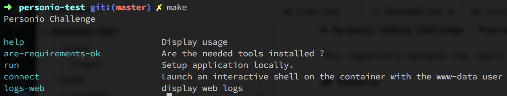
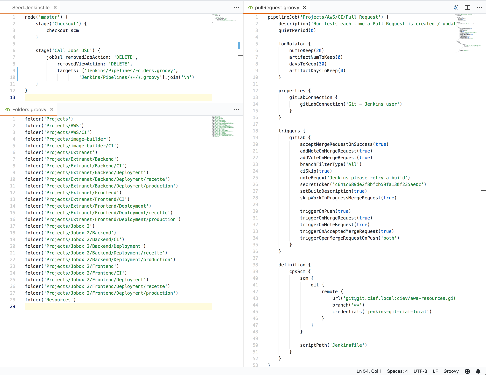
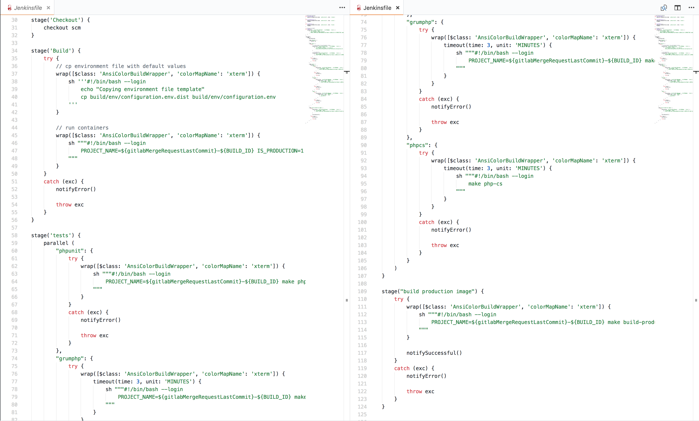
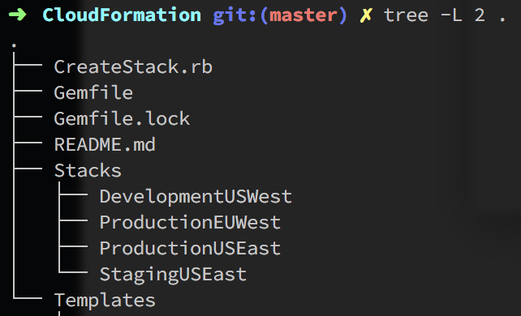

# Personio coding challenge - Niyi Adegoke

This repository contains the result of the coding challenge.

## Scenario

The implementation I choosed is usual but pretty old (because of the API being on the same container as the front/back code), because I wanted to demonstrate a legacy use-case of an application, where you need to take care of some details you don't on modern applications.

The application is composed of:
 - a LAMP container
    - display a simple page of information, with usage of environment variable to adapt from development to production environment
    - exposing an API
 - a PHP worker, supposed to read messages from a queue
 - a database server
 - a redis server:
    - it helps to ensure HA, by caching SQL results when using the database. Leveraging load & requests needed to the server
    - store sessions, since containers are volatile we need to store that to a single place that will stay on container life-cycle
    - can be used to store feature-flags, that helps to ensure a quick software rollback, and deployment strategy, like activating the flag only on the customers we wants (the one that have signed a beta contract for example).

In a real-case scenario, it's kind of a 50/50 state of migration, because half of the job is already done: the worker is in place, and more can come, since an API exists to update the main database / application.

But, this API is still on the same container with the "legacy" application that serve HTML content to the customers.
Having this migration ongoing demonstrate the advantage of micro-services architecture and how we can easily migrate pieces of an application without having to change everything.

## Local development and usage

I'm used to create a simple `Makefile` for each project, because it allow easy developper interaction & self-explanation, like this:


The developper only need to type `make` on the console, and he knows what he can do or not. Then reading the command description and running it allow them to works faster.

It's also useful to hide all the docker / configuration / magic of the tasks, since the developers want to focus on what matter: the software. It allow the DevOps team to manage the complexity of the development process ny using `docker-compose` or even `minikube / kubectl` without having the developper to really care about.

In this case, I decided to use `docker-compose` since I'm more used to than `minikube` and Kubernetes usage for a local environment. But this demonstrate how easy it'll be for the team to change the whole logic of a command, without interupting the developper workflow or usage.

### Creating the local working environment

Simply run `make run` in your console, then it'll check the needed dependencies (docker and so on), and will create it for you.

You'll then have 4 containers running, thanks to docker-compose. Using minikube & kubernetes will be a **major** plus for the project, since the production environment is using kubernetes, and we want to be as close as possible to it.

And for example, sometime a `composer install` can't be ran from the docker container, because we need to checkout from private repository.
And the container can't, since the ssh key & git configuration is on the server or the developer laptop. The Makefile make this case easier to resolve - without using a lot of tricks to inject the needed files and configuration to the container (which mission is to run an application, not to build it) - by running the `composer` command from the host directly, or from another docker container for example.

This dummy example is just there to explain the possibility offered by this approach: lot of flexibility.

#### Behind the scene

Each application is using a dedicated `Dockerfile` and specific environment files, that allow to easily configure it.

##### Environment variables

Using environment files is mandatory: we don't want to commit or, even worse, store any sensible information on the containers. Using environment variables make this tasks easy, since everything, from technical values ("do we want a debug log level ?") to business ones ("let configure this feature like this for now, and change it later if needed"). It make it very versatile to do so with it.

##### Containers configuration

Each container is using a dedicated image from the official source for PHP:
 - web app is using apache2 & php
 - cli / worker app is using php-cli

We could have used alpine images, to reduce the image size. It depends of the usage. Sometime you need some specific system packages for PHP to run some extensions, so it can be useful to use official images, since it's based on Ubuntu. Compared to Alpine images, more packages are availables if needed.

Having a smaller image is also better for:
 - docker hub we're using, to reduce storage
 - deployment, since the `docker pull` process will be faster (also, reducing layers can be interesting, since each layer contain the previous one...)
 - development process on a laptop: faster for the developer to pull different images fast (this is nitpicking !)

##### Docker Compose configuration

Docker compose have kind of a limitation out of the box: when you're working on multiple projects, same port can be used twice. docker-machine can be a solution to that, since it allow to have a dedicated docker server for each project, but it's a PITA:
 - multiple projects can't talk easily between then, since they're on differents networks
 - it's heavy: one VM per project
 - it's not a best-practice

Solutions to that can be:
 - using kind of a DNS resolver on each project to avoid conflict: hiding the complexity by adding more complexity
 - using strict port list, each project using a dedicated set of ports
 - creating a dedicated network interface for each project

Also, the **main point** is that even if we're using docker containers, it's not a mirror of the production. That is why using Minikube and Kubectl commands are better in this case. The `deployment.yml` file stay the same, and you only have to add volumes if needed for you to work efficiently.
With it, the whole stack stay exactly the same as in production, and avoid any surprise on deployment.

##### Docker logs

As dictated by docker best practices, we should never write to the disk for performance reasons and to avoid loosing something important written on a volatile container.

The same apply for the logs: we want them to be sent to the stdout of the container, then the orchestrator collect them, and we can push all of of the containers logs to a dedicated stack, like SumoLogic or Splunk.

It's even better if the log content is formatted in json for all the containers, with a specific structure. It'll ease the later search on the log collector, and we'll be able to do some search around all containers in one time, without having to manage a specific formatting everytime.

## Applications usage / demo

Once you have run the `make run` command, all the containers are up and working. You can reach the web container (the only one exposed) on `127.0.0.1:80` URL.

### web app

It'll display some informations. And it can be used as a healthcheck endpoint (using a dedicated `/healthcheck` or `/ping` endpoint make more sense, but isn't done on this challenge, since it's big-pictures view).

The healthcheck allow the Load-Balancer to check if traffic can be routed to the container or not. We don't want to route any traffic to a non-working container.

### worker app

The worker app is simply doing a `while(true)` loop, to simulate a worker behavior, like pulling messages from a SQS queues.

Talking about SQS queues or others AWS specific-resources, the best practice are:
 - to emulate the behavior, by using a docker image to do so. Like [docker-SQS-local image](https://github.com/vsouza/docker-SQS-local).
 - to use kind of a local feature flag based logic.

The "local feature flag logic" for example can be: when using a S3 bucket, you don't want a dedicated bucket for each developer. Lot of resources to manage, and also credentials to take care of. It's not worth it.

The usage I'm doing is to use an abstraction on the codebase, to switch between local storage on disk when running on a development environment (developer laptop) and then using the S3 storage for all the other environment. The abstractions share the same interface, which make them identitcal to use. And should also be deeply tested to ensure quality.

It allow to work smoothlessly without thinking about what's going on the code. And it keep developpers away from AWS architecture, and avoid to mess with it for development purpose.

## CI / CD process

On my example, I'm using a Jenkins server, with DSL definition to create the pipeline from code, and use it.
The Jenkins server also use a dedicated script to deploy on ECS.

### Jenkins-side code

#### Creating the project code used by Jenkins

Jenkins is a great piece of software that make tests & shipping accessible and highly configurable.
The problem is that we take too much care of Jenkins, and if one day the server die, we'll lost a lot, and it'll make any deployments imposssible.

Thanks to the [Jenkins Job DSL API](https://jenkinsci.github.io/job-dsl-plugin/) plugin, our life just become easier.
All Jenkins pipeline / plugins / configuration can be defined by code and stored on a dedicated repository. Jenkins should be able to be resilient and to have the same behaviour as a docker container: volatile, and not cared as much as a dedicated server.

In Jenkins, one simple step is needed to achieve that: install the plugin and create a pipeline manually (it'll be the only one). This pipeline will listen to changes on the master branch of the repository, and run a script from it.
This script will: create folders, jobs, pipelines.. and configure Jenkins.

Please see an example bellow:


On the screenshot you can see:
 - the seed job (`Seed.Jenkinsfile`) which is the *root* script
 - the script that creates the folders (`Folders.groovy`). To make the pipeline display a bit better by team / project / purpose
 - a pipeline (`pullRequest.groovy`), which will listen to GitLab events (`trigger` section) and then execute a definied script. The script (`Jenkinsfile`) is located on the repository that is checked out, which is better for the developper to keep all the test logic on the project itself, rather than having piece of code everywhere.

**secret management**: we also take advantage of Jenkins secret management. But thanks to the bash code, we can also use AWS Secret Manager or any other provider. We can easily adapt to any scenario or provider.

### Project side-code

On the project, we'll find a `Jenkinsfile` on the rootpath, which will contain all the logic defined by the developers to test the application as they want.

Here is a quick example of how it's done. Please note the usage of `makefile` commands, which ensure we use the same reproducable process on every possible environment.



## Extra content

### AWS CloudFormation template

I use AWS on a daily basis, Terraform and CloudFormation, because I don't want to create a resource manually, and then having to create it again on another environment. Human do make errors. Code don't. For this project, I'm using CloudFormation.

I like to use the same structure on the templates, which make them easier to maintin over time.

#### VPC mapping logic

Please see the following template:
```json
{
    "AWSTemplateFormatVersion": "2010-09-09",
    "Description": "Create security groups rules for a dedicated VPC",
    "Parameters": {
        "VpcId": {
            "Description": "VPC id",
            "Type": "AWS::EC2::VPC::Id"
        }
    },
    "Mappings": {
        "VpcMap": {
            "vpc-XXXXXX": {
                "Environment": "recette"
            },
            "vpc-YYYYYY": {
                "Environment": "production"
            }
        }
    },
    "Resources": {
        "defaultSecurityGroup": {
            "Type": "AWS::EC2::SecurityGroup",
            "Properties": {
                "GroupDescription": "A security group",
                "VpcId": { "Ref": "VpcId" },
                "Tags": [
                    { "Key": "Name", "Value": { "Fn::Join": ["", [{ "Fn::FindInMap" : [ "VpcMap", { "Ref" : "VpcId" }, "Environment"] }, " - security group"]] } },
                    { "Key": "environment", "Value": { "Fn::FindInMap" : [ "VpcMap", { "Ref" : "VpcId" }, "Environment"] } }
                ]
            }
        }
    }
}
```

Here we're only asking for a VPC. A VPC represent an environment inside a region. It's the most effective way to target a dedicated environment.

This way, only a VPC is required in the parameters, since all the necessary values are retrieved from the mapping structure. This can be done for AMI, SG, bucket or environment name. For all sensible informations, like RDS master user/password for example, we need to use parameters, with a `noEcho` set to `true`. This way, no one can retrieve the password from the repository, or from the template in CloudFormation.

#### Parameters usage

Consider the following template:
```json
{
    "AWSTemplateFormatVersion": "2010-09-09",
    "Description": "Create recette VPC / subnet / NAT / route table architecture",
    "Resources": {
        "NetworkArchitecture": {
            "Type": "AWS::CloudFormation::Stack",
            "Properties": {
                "TemplateURL": "https://s3.amazonaws.com/MY-AWESOME-S3-BUCKET/VPC-template.json",
                "Parameters": {
                    "VPCCIDR": "172.20.0.0/16",
                    "PrivateSubnetOneCIDR": "172.20.10.0/24",
                    "PrivateSubnetTwoCIDR": "172.20.11.0/24",
                    "PrivateSubnetThreeCIDR": "172.20.12.0/24",
                    "PublicSubnetOneCIDR": "172.20.20.0/24",
                    "PublicSubnetTwoCIDR": "172.20.21.0/24",
                    "PublicSubnetThreeCIDR": "172.20.22.0/24"
                },
                "Tags": [
                    { "Key" : "Name", "Value" : "network architecture" }
                ]
            }
        }
    }
}
```

This CloudFormation template allow to have reproductible environment, in a different way. It can keep the final template simpler.

The final template (`https://s3.amazonaws.com/MY-AWESOME-S3-BUCKET/VPC-template.json`) will then create the VPC / NAT / Subnets and so on...

#### Template inclusion & merging

On the following example, the goal was to use the same template for multiple AWS account, each dedicated to a specific product. As a DevOps team, we wanted to use the same templates for all the account, to ease maintenance.

We used CloudFormation, with a simple code of Ruby (that I can't disclose here) that was doing JSON merging of files.



On the `Templates` folder we can find for example a `Jenkins.json` file, which allow us to create a new Jenkins server. Simply create a new stack on the `Stack/< account >/< region >` folder, with proper configuration. Then the script is executing it properly and dynamically.

#### CloudFormation examples

When creating a VPC network, you want to keep your EKS / ECS / business components on a private network. But you also want to be able to ssh on them.

Using a Bastion server is mandatory (a server that is on the public subnet, with a **fixed** IP, that can reach the private subnet).

You can take a look at the template there: [assets/CloudFormation/bastion.json](assets/CloudFormation/bastion.json).

The template use the mapping logic described before, the parameters (to add more security groups if needed). Auto-scaling too. And also AWS EC2 API to be able to assign automatically the allocation-id of the static IP we want to use (we don't want to change it, since we'll rely a lot on it).


Another example will be an ECS cluster, with autoscaling based on CPU usage to scale automatically. The ALB (Application Load Balancer), which is also doing the discovery job on ECS architecture, should be created on a separate template: it depends of the project and not from the cluster.

You can take a look at the template there for the ECS cluster: [assets/CloudFormation/ecs-cluster.json](assets/CloudFormation/ecs-cluster.json).

And for the application part, with the ALB: [assets/CloudFormation/application-stack.json](assets/CloudFormation/application-stack.json).

### Ansible

I'm using Ansible a lot, to automate server creation. Mainly on AWS, to package AMI (for ECS, legacy servers...) and even AMI that were used to deploy a PHP application (when the team wasn't able to use docker quickly).
Also used it to manage on-premise servers.

#### Legacy usage

On legacy architecture, with not so many automation possible, the server is created manually, and Ansible run on it to provision it. And then keep it updated.

Modules can be used to create the VM, provision and then package it, but I never had the chance to work with a recent VM manager (always old VSphere licenses...) which make it really hard to automate on it. Ansible modules exists, but they're not production ready, with lot of undocumented code & API to use.

#### AWS usage

Modules can be used to create, provision and package an AMI on AWS, but it's not optimal for me, since it make the recipes more complex than they should.

Using [Packer](https://www.packer.io) is way better, and each tool focus on only one specific task.

A packer example usage will be like:
```json
{
    "variables": {
        "aws_access_key": "",
        "aws_secret_key": "",
        "ami_name": "",
        "playbook": "",
        "iam_instance_profile": "",
        "launched_by": "",
        "launched_from": "",
        "build_number": "none",
        "provider": ""
    },
    "builders": [
        {
            "type": "amazon-ebs",
            "communicator": "ssh",
            "ssh_pty": true,
            "ssh_username": "centos",
            "access_key": "{{ user `aws_access_key` }}",
            "secret_key": "{{ user `aws_secret_key` }}",
            "region": "us-west-1",
            "source_ami_filter": {
                "filters": {
                    "virtualization-type": "hvm",
                    "name": "*CentOS Linux 7 x86_64 HVM EBS*",
                    "root-device-type": "ebs"
                },
                "owners": ["679593333241"],
                "most_recent": true
            },
            "vpc_id": "vpc-XXXXXX",
            "subnet_id": "subnet-YYYYYY",
            "instance_type": "t2.micro",
            "ami_name": "{{ user `ami_name` | clean_ami_name }}",
            "associate_public_ip_address": "true",
            "security_group_ids": [
                "sg-XXXXXX",
                "sg-YYYYYY"
            ],
            "iam_instance_profile": "{{ user `iam_instance_profile` }}",
            "ami_regions": "eu-west-3",
            "run_tags": {
                "Name": "Image builder - {{ user `playbook` }}",
                "ansible-playbook": "playbook/{{ user `playbook` }}.yml",
                "launched-by": "{{ user `launched_by` }}",
                "launched-from": "{{ user `launched_from` }}",
                "jenkins-build-number": "{{ user `build_number` }}"
            },
            "tags": {
                "Name": "{{ user `ami_name` | clean_ami_name }}",
                "ansible-playbook": "{{ user `playbook` }}.yml",
                "created-by": "{{ user `launched_by` }}",
                "launched-from": "{{ user `launched_from` }}",
                "jenkins-build-number": "{{ user `build_number` }}"
            }
        }
    ],
    "provisioners": [
        {
            "type": "ansible",
            "playbook_file": "playbook/{{ user `playbook` }}.yml",
            "extra_arguments": [
                "--vault-password-file", "./secrets/vault_password"
            ],
            "user": "centos"
        }
    ]
}
```

This packer configuration allow to run Ansible on a CentOs EC2 instance in `us-west-1`, to create an AMI from it, and then to copy the AMI on `eu-west-3` region. We can also share it to others AWS account if we manage more than one.

The CentOs base image will always be the latest one available, to keep our servers updated. And also we check the user owning the image to only trust the CentOs account ID, and avoid crappy images. The running EC2 instance (used for Ansible to run locally, or remotely, as wanted) will be tagged with the `run_tags` list. And the created AMI will be tagged by the `tags` list.

Putting the build number on it allow us to track every changes.

Also, we're using **variables** on the configuration file, to make sure we don't commit any sensitive data. And everything can be configured. For example, the Jenkins pipeline will inject the user running the job to the EC2 & AMI tags. AWS credentials are also used thanks to variables.

And as you can see, we're using Ansible Vault, to pass encrypted vauld file, that allow us to store secrets inside the code repository. We only need to pass the correct password with the `--vault-password-file` option to allow Ansible to decrypt the files.

#### Role example

As an example of Ansible role I'm used to write, please see the following: [assets/ansible/traefik](./assets/ansible/traefik).

Traefik is a simple but really powerful reverse-proxy & discovery I used in the past for Docker POC & production environment.

#### Automation with an AMI-builder

Then, each time a playbook is modified on the Ansible git repository, we can trigger an automatic build process, that will create the AMIs. I'm getting used to call that an "AMI builder" since it builds AMI...

Please find an extract of a Jenkins pipeline to launch the build of an AMI.
```groovy
def validateParameters() {
    if (params.environment == '' || params.environment.isEmpty()) {
        error("Missing valid 'environment' parameter")
    }

    // and so on...
}

timestamps {
    node('ami-builder') {
        stage('Validate Parameters') {
            validateParameters()
        }

        stage('Build AMI') {
            sh """#!/bin/bash
                make run ENVIRONMENT=${params.environment} RECIPE=${params.recipe} OS=${params.os} AMI_NAME=${params.environment}-${params.ami_version} USER=${BUILD_USER_ID} PROFILE=${params.iam_profile} IS_JENKINS_BUILD=1 JENKINS_BUILD_NUMBER=${BUILD_DISPLAY_NAME}
            """
        }
    }
}
```

Here again, the Jenkins pipeline wait for some parameters before running, which make the job 100% configurable. And I'm also using a Makefile file to manage all the needed scripts for the image-builder.

### Some side projects I worked on

#### New Eden

The new-eden project was developped in Go, and the goal was to be able to deploy in a CoreOs cluster. At the time of this project (almost 2 years ago) all the deployment process was done manually by developers ssh'ing on the servers to update the systemd declaration, register configuration on `etcd` and then update the fleet deployment with `fleetctl`.

This was not enough when the company moved more & more to docker containers, so I created a quick software (an API and an CLI) to help developpers deployment easily & rollback too.

The API was responsible for the whole deployment logic. using an API was a big plus in the time being, since a Lambda function will be able to call it, a chatBot too... It was perfect to start automating everything.

Then, the developper had a CLI installed, which was also developped in Go. And the CLI was "just" calling the API, and by helping the developper a bit by giving details or explicit error messages.

Then, the deployments went smoother for the team, and errors of SSH commands were past us.

The project then got useless when we started using ECS deployment with a Jenkins pipeline.

#### ECS blue-green deployment

I created some Jenkins scripts to make ECS deployment easier, by being able to run blue-green deployment. This is supposed to be managed by ECS orchestrator & configuration, but it was never a big success and wasn't realiable a lot.

The script was doing a simple logic:
 - first deployment: create a service, ensure all containers runs.
 - second deployment: create another service, deploy it. Wait for containers to run. Then stop previous service.
 - for N >= 3 deployments: check which service is currently active, then use the inactive service to launch the new deployment. Wait for containers to run. Stop previous service.

Jenkins allowed me to add some user prompts, to avoid killing the previous running version, and waiting developper decision to take action. Which allow the developper to rollback really quickly when necessary.

Please see the following script that make this possible with ECS: [assets/scripts/deployToEcs.Jenkinsfile](assets/scripts/deployToEcs.Jenkinsfile)

The script isn't perfect, since we didn't used AWS Secret Management capabilities, and task definitions were stored on a S3 bucket. But this was a first approach used, and was working fine with multiple teams on it.


## Conclusion

The goal when creating a high-availability architecture is to avoid any SPOF (Single Point Of Failure), by making the architecture:
 - scale automatically (based on metrics from servers and application)
 - self healing, by discovery process and healthcheck endpoint on every container
 - lambda functions that can monitor legacy servers / applications

And on software side, we should think about:
 - how to relief pain on database & any service used
 - cache as much as we can, on Redis (or any other key value store)
 - separate business and technical tasks, by following the micro-services best-practice: a service should do one thing, and only one
 - using queues when possible, to do async process: easy to scale, easy to maintain
 - all micro-services talking with a standard API

In fact, moving to an event-driven architecture from a data-driven architecture helps a lot to achieve the high-availability goal.

## End

I detailled my thinking process & my capabilities, I hope it make sense to you.

Don't hesitate to reach me for further details if you want !
